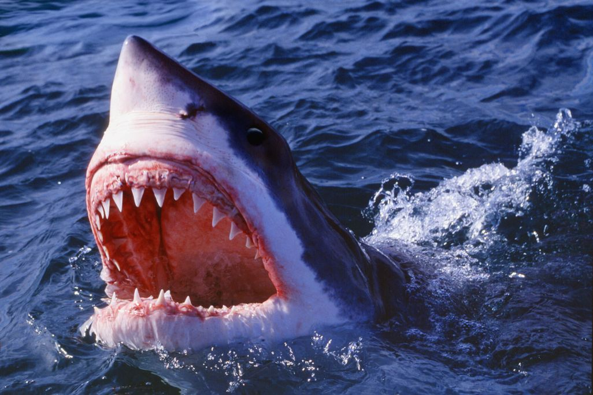
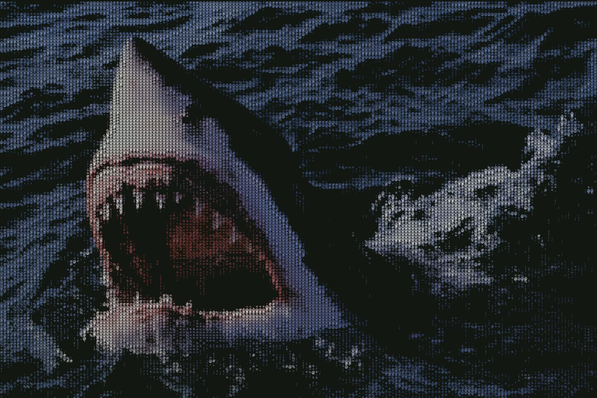

# ASCII Image Generator

Converts any image into colored ASCII art and saves it as a `.png` file.

---

## Preview

| Input | Output |
|-------|--------|
|  |  |

---

## How It Works

- Loads an image and applies contrast enhancement and local histogram equalization (CLAHE)
- Maps pixel brightness values to ASCII characters ordered by visual density
- Renders the characters with their original colors onto a canvas and saves it as a PNG

---

## Requirements

- Python 3.8+
- [Courier Prime](https://fonts.google.com/specimen/Courier+Prime) font (`CourierPrime-Regular.ttf`)

Install dependencies:

```bash
pip install -r requirements.txt
```

---

## Usage

1. Place your image in the project folder
2. Open `asciigen.py` and update these two lines:

```python
input_path = "your-image.jpg"
output_path = "your-output.png"
```

3. Run:

```bash
python asciigen.py
```

The output PNG will be saved in the same folder. A preview window will also open.

---

## Settings

| Variable | Default | Description |
|----------|---------|-------------|
| `detail` | `180` | Number of ASCII columns — higher detail means smaller font size and finer output |
| `colored` | `True` | Color output vs grayscale |
| `depth` | `True` | Use brightness for grayscale intensity |
| `threshold` | `0` | Pixels below this brightness become spaces |

The background color can also be customized. In `ascii_to_png`, find this line and replace the RGB values:

```python
canvas = Image.new("RGB", (...), (20, 25, 18))  # change (20, 25, 18) to any color
```

---

## Files

```
asciigen.py              - Main script
requirements.txt         - Python dependencies
CourierPrime-Regular.ttf - Required font
demo.jpg                 - Sample input image
```
